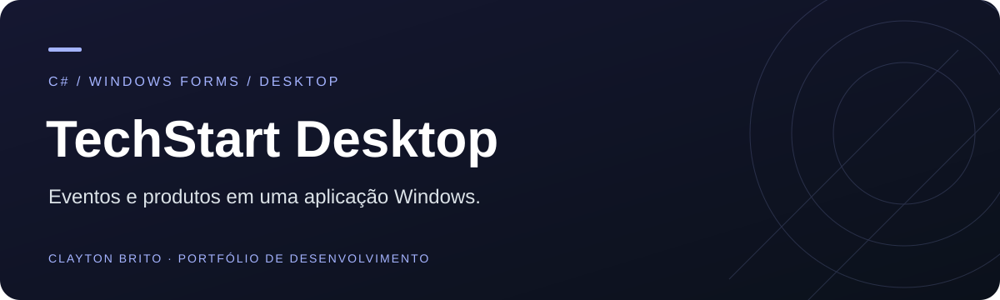
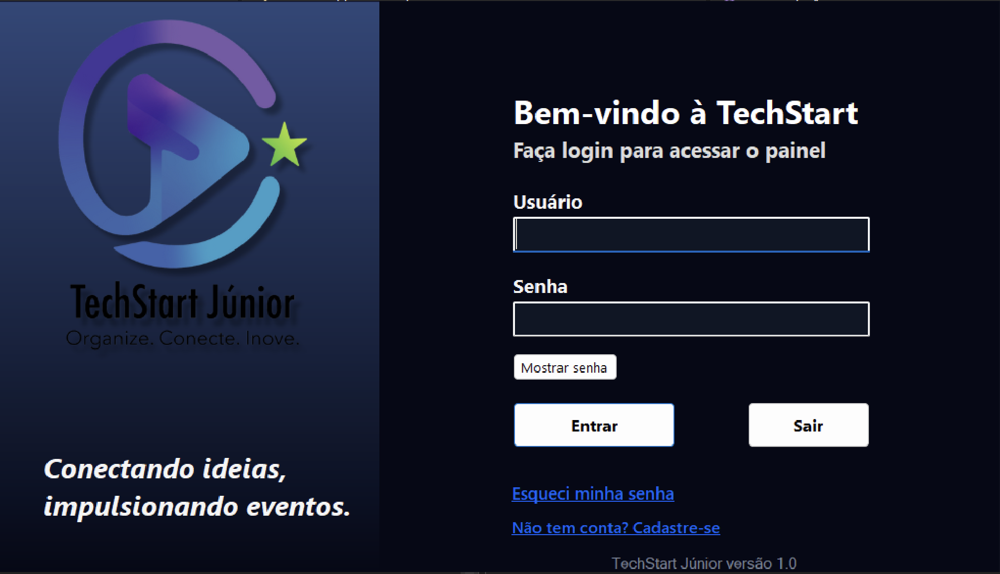
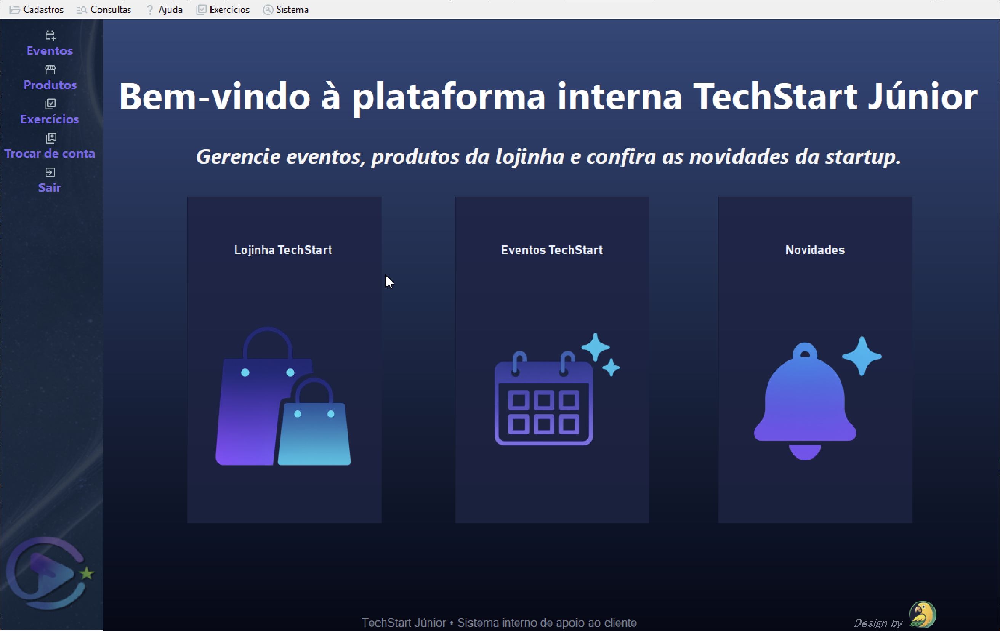

# TechStart · sistema desktop

**Cadastro e consulta de eventos e produtos em uma interface Windows Forms.**

`C#` · `.NET Framework 4.7.2` · `Windows Forms` · `Arquivos locais`

[Landing page ↗](https://ghostriley115.github.io/techstart-landing-page/) · [Código da apresentação](https://github.com/GhostRiley115/techstart-landing-page)

## A proposta

A TechStart é uma startup fictícia usada como contexto para desenvolver uma aplicação desktop acadêmica. O sistema transforma operações de cadastro, consulta, edição e exclusão em telas de uso direto, exercitando eventos de interface, validações e persistência em arquivos.

## Por dentro da aplicação

| Login | Painel principal |
| :---: | :---: |
|  |  |

## Funcionalidades

- Fluxos de login e cadastro de usuários.
- Cadastro, consulta, edição e exclusão de eventos.
- Cadastro, consulta, edição e exclusão de produtos.
- Persistência local em arquivos de texto.
- Navegação entre formulários a partir da tela principal.

## Escolhas técnicas

| Tecnologia | Papel no projeto |
| :--- | :--- |
| C# | Lógica e eventos da aplicação |
| Windows Forms | Telas e componentes de interface |
| .NET Framework 4.7.2 | Plataforma de execução para Windows |
| Arquivos `.txt` | Armazenamento local dos cadastros |

Os dados ficam na pasta `dados`, junto ao executável. O projeto é uma demonstração acadêmica com armazenamento local; não contém uma camada de banco de dados ou serviço remoto de autenticação.

## Executar no Windows

1. Instale o Visual Studio com a carga **Desenvolvimento para desktop com .NET** e o targeting pack do **.NET Framework 4.7.2**.
2. Clone este repositório.
3. Abra `TechStart.Solution/TechStart.Solution.slnx`. Se sua versão não reconhecer `.slnx`, abra `TechStart.Solution/TechStart.App/TechStart.App.csproj`.
4. Defina `TechStart.App` como projeto de inicialização, compile e execute.

O login procura `dados/usuarios.txt` na pasta de saída. O arquivo de usuários incluído no projeto está configurado para cópia na compilação. Eventos e produtos usam `eventos.txt` e `produtos.txt`; caso vá importar dados de exemplo, observe que o arquivo de produtos versionado possui o nome `produtos.txt.txt` e precisa corresponder ao nome esperado pela aplicação.

## Explore também

A [landing page TechStart](https://github.com/GhostRiley115/techstart-landing-page) apresenta a identidade da startup e seus protótipos. Este repositório contém a aplicação desktop.

Projeto de estudo presente no [portfólio de Clayton Brito](https://github.com/GhostRiley115).
